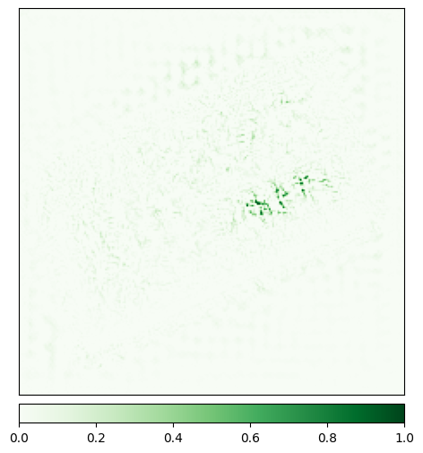
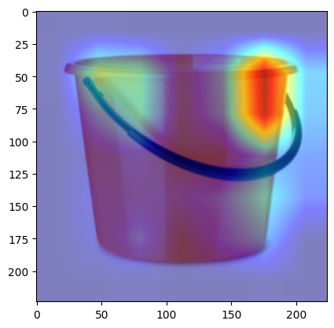
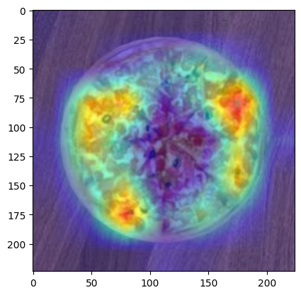
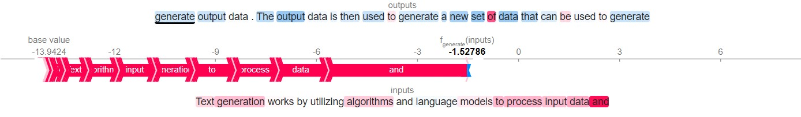

# Model Explainability

## Vision Models (TIMM)

`resnet18` model from Hugging Face was used and model explainability was compared by running different explainability methods on 10 different Imagenet class images.

Classes are: Banana, Bucket, Cat, Envelope, Leopard, Pizza, Restaurant, Sunglass, Tank, and Volcano.

Methods used are: IG, IG w/ Noise Tunnel, Saliency, Occlusion, SHAP, GradCAM, and GradCAM++.

### Method: IG (Integrated Gradients)

<figure><figcaption>Banana</figcaption></figure>
<figure><figcaption>Bucket</figcaption></figure>
<figure><figcaption>Cat</figcaption></figure>
<figure><figcaption>Envelope</figcaption></figure>
<figure><figcaption>Leopard</figcaption></figure>
<figure><figcaption>Pizza</figcaption></figure>
<figure><figcaption>Restaurant</figcaption></figure>
<figure><figcaption>Sunglass</figcaption></figure>
<figure><figcaption>Tank</figcaption></figure>
<figure><figcaption>Volcano</figcaption></figure>

### Method: IG w/ Noise Tunnel

### Method: Occlusion

### Method: SHAP

### Method: GradCAM

<figure><figcaption>Banana</figcaption></figure>
<figure><figcaption>Bucket</figcaption></figure>
<figure><figcaption>Cat</figcaption></figure>
<figure><figcaption>Envelope</figcaption></figure>
<figure><figcaption>Leopard</figcaption></figure>
<figure><figcaption>Pizza</figcaption></figure>
<figure><figcaption>Restaurant</figcaption></figure>
<figure><figcaption>Sunglass</figcaption></figure>
<figure><figcaption>Tank</figcaption></figure>
<figure><figcaption>Volcano</figcaption></figure>

### Method: GradCAM++

<figure><figcaption>Banana</figcaption></figure>
<figure><figcaption>Bucket</figcaption></figure>
<figure><figcaption>Cat</figcaption></figure>
<figure><figcaption>Envelope</figcaption></figure>
<figure><figcaption>Leopard</figcaption></figure>
<figure><figcaption>Pizza</figcaption></figure>
<figure><figcaption>Restaurant</figcaption></figure>
<figure><figcaption>Sunglass</figcaption></figure>
<figure><figcaption>Tank</figcaption></figure>
<figure><figcaption>Volcano</figcaption></figure>

## Text-Generation Models from Hugging Face

Three different pretrained models from hugging face was used and same text was used to compare explainability using SHAP.

1. gpt2

2. gpt2-medium

3. google/flan-t5

